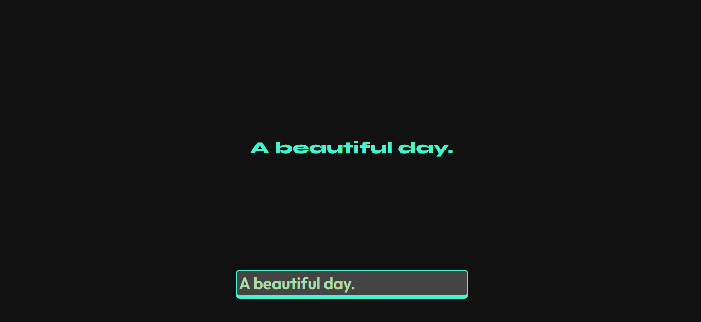
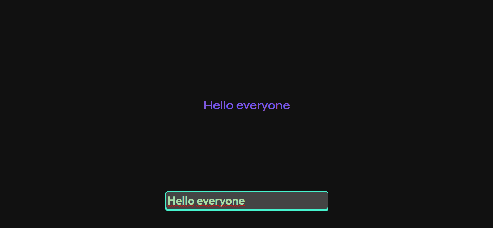
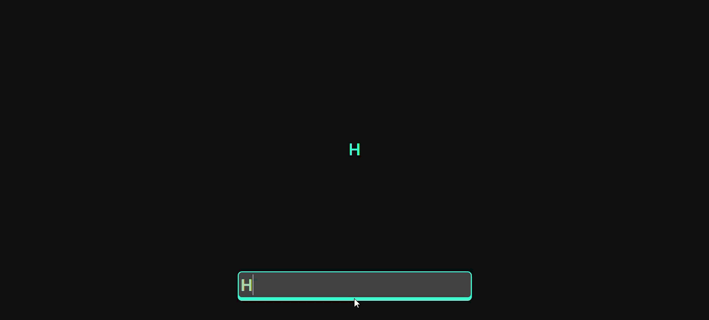

# Type Decay
Welcome to Type Decay! It's a small project where, whenever you type a letter, the website changes the font, color and weight of the font displayed!

## What each function does in `script.js`?

- `randomHexColor`: This function simply selects a color in hex and returns it!
- `randomFontConfig`: This function returns all the data for the font! It returns the `data` object with the necessary settings to chance the fontFamily, fontWeight, color, fontStyle, and textShadow (the shadow is random, may or may not appear)
- `update`: This function is responsible for updating the values received from the `randomFontConfig` function, as well updating them to the text you enteres in the input

## Here are some images from my project:

 

